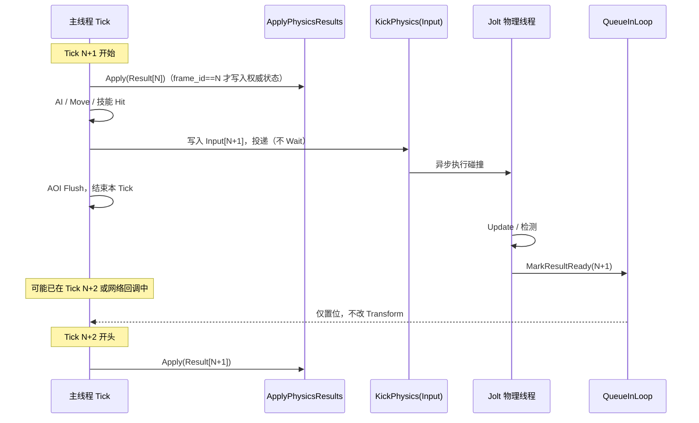

# 异步 Jolt 碰撞：固定晚 1 帧双缓冲管线（生产级方案）

> 适用项目：龙之谷世界向 3D 动作服（当前 demo：单 EventLoop + 单线程 `WorldSystem::Tick`）  
> 目标约束：**主线程不等待物理**；物理在独立线程算完后回抛；回抛时主线程往往已进入下一逻辑帧。  
> 结论：采用 **固定晚 1 帧双缓冲 + 帧号/世代作废**；技能命中仍在主 Tick **同步**计算。

---

## 1. 问题背景

当前形态（demo）：

- 网络 + 定时器 + `WorldSystem::Tick` 跑在同一条 `zrpc::EventLoop` 主线程上。
- Tick 内同步：`AI → Move → SyncAllBodies → Jolt::Update → AOI Flush`。
- 单线程难以支撑生产规模的 CPU 预算。

若改为：

1. 主线程把本帧碰撞输入 **异步投递** 到 Jolt 物理线程；
2. 物理线程算完后经 `QueueInLoop` / `RunInLoop` **回主线程**；

则回抛时刻常见情况是：

- 发起帧 `Tick N` 已经结束；
- 主线程可能已在执行 `Tick N+1`，或正处在 N 与 N+1 之间的网络回调中。

**不能**指望“算得够快就一定赶在下一帧前回来”。生产级做法是：**承认固定 1 帧延迟，并把 Apply 钉死在下一 Tick 开头**，用帧号保证不错乱。

---

## 2. 方案总览

| 项 | 选择 |
|----|------|
| 主线程是否 Wait 物理 | **否** |
| 物理结果相对逻辑的延迟 | **固定晚 1 个逻辑帧**（30Hz 约 33ms） |
| 内存隔离 | **双缓冲**（或环形 2 槽）Input / Result |
| 防打脸 | **`frame_id` + `entity_generation`**，过期丢弃 |
| 积压策略 | 物理忙则只保留最新快照，**禁止多帧结果串行 Apply** |
| 技能 / 受击判定 | **主 Tick 同步**（不绑在异步 Jolt Update 上） |
| Jolt 职责 | 环境碰撞：墙 / 地面 / 胶囊挡格 / 落地等 |

```text
主线程 Tick N+1                    物理线程
────────────────────────────────────────────────────
Apply(Result[N])                   （上一帧已算完）
AI / Move / 技能 Hit（同步）
采集 Input[N+1] ──投递（不 Wait）──►  计算 Input[N+1]
AOI Flush                          …
（去处理网络等）                    写 Result[N+1]
                                   QueueInLoop：标记“N+1 就绪”
```

---

## 3. Apply 含义（术语定义）

### 3.1 一句话

**Apply** = 在主线程上，把物理线程产出的 **某一帧碰撞结果**，安全地写入当前权威游戏状态（Transform / 速度 / 落地标志等）的过程。

它是「物理结果 → 业务世界」的 **唯一写入口**，不是物理计算本身，也不是简单的 `QueueInLoop` 回调。

### 3.2 Apply 做什么

典型包括（按项目需要裁剪）：

| 动作 | 说明 |
|------|------|
| 位置校正 | 用物理得到的合法位置修正 `TransformComponent`（挡墙、防穿地） |
| 速度 / 运动状态 | 更新落地、滑墙后的水平速度、是否 grounded 等 |
| 接触摘要 | 写入本帧接触法线、支撑面等信息，供下一拍 Move / Jump 使用 |
| 触发脏标记 | 若位置变化需进 AOI，则 `MarkPropertyDirty`（真正广播仍走 Tick 末 Flush） |
| 校验与丢弃 | 核对 `frame_id` / 实体仍在图 / `generation`，非法则 **整帧跳过** |

### 3.3 Apply 不做什么

- **不**在物理线程里改 `Entity` / AOI / 协议。
- **不**在 `QueueInLoop` 回调里“顺手”改位置（易插在 move 包与半截 Tick 之间）。
- **不**执行技能 Hit、伤害结算（应留在主 Tick 同步逻辑）。
- **不** Wait 物理线程；Apply 只消费 **已经完成** 的 Result 槽。

### 3.4 何时调用 Apply（硬规则）

```text
WorldSystem::Tick(dt):
  1. ApplyPhysicsResults()     ← 唯一推荐落点：Tick 开头
  2. monster_ai_system_.Tick
  3. full_move_system_.Tick
  4. 采集快照 → 投递物理（Kick，不 Join）
  5. aoi_.FlushDirty()
```

| 落点 | 是否允许 | 原因 |
|------|----------|------|
| **Tick 开头** | ✅ 必须 | 本帧 AI/Move 基于已校正世界；延迟语义固定为 1 帧 |
| `QueueInLoop` 回调里直接改 Transform | ❌ | 可能插在网络 handler 中间，造成旧结果覆盖新输入 |
| Tick 中间（Move 之后） | ❌ | 易出现“先按未校正位积分，再被旧帧拉回”的抖动 |
| Tick 末尾（AOI 之后） | ⚠️ 不推荐 | 本帧广播的是未校正位，且下一帧 Move 前还要再 Apply 一次更清晰 |

### 3.5 Apply 与帧号

```text
logic_frame = N+1 时：

  仅当 result.frame_id == N      → Apply
  result.frame_id < N            → 过期，丢弃
  result.frame_id > N            → 异常（不应出现），丢弃并打点
  entity 已 LeaveMap / generation 变化 → 丢弃
```

**含义：** Apply 不是“有结果就写”，而是“只把 **上一逻辑帧** 的物理真相合并进当前权威状态”。

### 3.6 Apply 与回抛回调的分工

```text
物理线程完成
  → QueueInLoop( MarkResultReady(frame_id) )   // 轻量：置位/换槽

主线程下一 Tick 开头
  → ApplyPhysicsResults()                      // 重逻辑：写 Transform 等
```

- **回抛**：只通知“Result 槽已就绪”（可唤醒或仅设原子标志）。
- **Apply**：在 Tick 屏障处批量消费就绪结果。

这样即使回抛时主线程已在下一帧逻辑中，也 **不会立刻改状态**；真正改状态发生在明确的 Apply 点。

---

## 4. 双缓冲与数据所有权

### 4.1 槽位

建议两套（或环形长度 2）：

- `InputSlot[2]`：主线程写入的快照（位置、朝向、body_id、velocity、frame_id…）
- `ResultSlot[2]`：物理线程写入的结果（校正位置、grounded、contact…、frame_id）

### 4.2 所有权规则

| 阶段 | 主线程 | 物理线程 |
|------|--------|----------|
| 写 Input[N] | 独占写 | 不可读该槽 |
| Kick 之后 | 不可再改该 Input | 独占读 Input、写 Result |
| Result 就绪到 Apply 前 | 可读就绪标志 | 不可再写该 Result |
| Apply 中 | 独占把 Result 写入 ECS | 不碰 Entity |

物理线程 **禁止** 持有 `Entity*` / `shared_ptr<Entity>` 做读写；只使用投递时拷贝的 POD/快照。

---

## 5. 时序（生产语义）



**关键语义：**

- “回抛时已在下一帧”是 **预期行为**，不是故障。
- 不错乱靠的是：**延迟固定 + Apply 点固定 + 帧号作废**，而不是靠物理更快。

---

## 6. 积压与降级（生产必备）

| 情况 | 策略 |
|------|------|
| 物理耗时 &lt; 1 帧 | 正常：Tick 开头总能 Apply 到上一帧 |
| 物理耗时 ≈ 1～2 帧 | 丢弃过期 Result；逻辑暂时用未校正位，打监控 |
| 物理持续跟不上 | 降 collision steps / 减检测实体 / 分区；**不要**无限 Queue |
| 同实体多结果 | 只保留 **最新完成** 的 `frame_id` |

原则：**宁可少 Apply 一次，也不要连 Apply 两次旧新结果造成拉回抖动。**

---

## 7. 与技能、AOI、网络的边界

| 子系统 | 线程 / 时机 | 说明 |
|--------|-------------|------|
| 技能 HitBox / 伤害 | 主 Tick 同步 | 动作手感与公平性；不依赖异步 Jolt |
| 环境碰撞（Jolt） | 物理线程 + Tick 头 Apply | 挡墙、地面、胶囊 |
| AOI | 主 Tick 末 Flush | Apply 导致的位移脏位，随本帧或下一帧 Flush 发出 |
| TCP / Handler | EventLoop | 与 Tick 同环；位移包建议进“下一拍输入”，避免与 Apply 竞态 |
| Mongo 回抛 | 已有 `RunInLoop` | 与物理回抛共享 pending 队列；物理回调必须轻量 |

---

## 8. 和同帧 Fork-Join 的对比（选型备忘）

| | 同帧 Join（主线程等） | 本方案：晚 1 帧双缓冲 |
|--|----------------------|----------------------|
| 主线程 | Wait / Join | **不等** |
| 延迟 | 0 帧 | **固定 1 帧** |
| 回抛落到下一帧 | 不存在 | **设计如此** |
| 适用 | 强同步贴墙且预算够 | 主线程要匀给 AI/AOI/协议 |
| 本项目选择 | 可作为过渡（先开 JobSystem 多核） | **异步投递的生产默认** |

过渡建议：demo 阶段可先 `JobSystemThreadPool` 多核、仍同帧 Join 验证玩法；上异步时 **一次性** 切到本文管线，避免“半异步随手 SetPosition”中间态。

---

## 9. 落地检查清单

- [ ] `ApplyPhysicsResults()` 仅在 `WorldSystem::Tick` 开头调用  
- [ ] 每个 Input/Result 带 `frame_id`；Apply 只接受 `logic_frame - 1`  
- [ ] 实体离图 / 传送 / 重生时 `generation++`，旧 Result 作废  
- [ ] `QueueInLoop` 回调不做重逻辑，只 `MarkResultReady`  
- [ ] 物理线程只读写快照槽，不碰 ECS  
- [ ] 忙时丢帧策略 + 指标：物理耗时、丢帧率、Apply 次数、过期丢弃次数  
- [ ] 技能命中路径不依赖异步 Result  
- [ ] 文档与实现一致后，更新 `flow-world-tick.md` 中的 Tick 顺序说明  

---

## 10. 术语表

| 术语 | 含义 |
|------|------|
| **Kick** | 主线程投递本帧 Input 快照到物理线程，立即返回 |
| **Apply** | 主线程在 Tick 开头，把已完成的物理 Result 写入权威游戏状态 |
| **Input 快照** | 某一 `frame_id` 下，供物理只读的 POD 数据副本 |
| **Result** | 某一 `frame_id` 下，物理产出的校正/接触结果 |
| **双缓冲** | 两套 Input/Result 槽交替使用，避免读写同一块内存 |
| **晚 1 帧** | 逻辑帧 N+1 使用的是物理帧 N 的结果 |
| **作废** | `frame_id` / `generation` 不匹配时拒绝 Apply |

---

## 11. 一句话总结

**主线程不等物理时，生产级做法是：固定晚 1 帧的双缓冲管线；Apply 专指在 Tick 开头把带帧号的物理结果写入权威状态——回抛只负责就绪通知，不负责改世界。**
