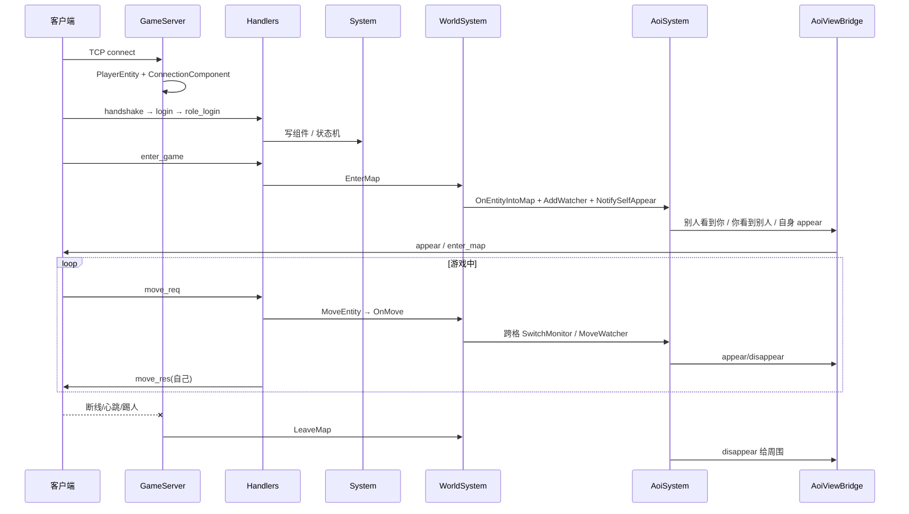

<!-- 拆自 CODE_FLOWS；权威目录 doc/server/ -->

## 13. 从 0 到 1 全生命周期

逐步文字版：

1. **启动** → 配置、世界、桥接、Handler、听端口、心跳、Tick  
2. **连接** → 临时实体  
3. **握手/登录/选角** → PES 缓存，状态走到 kRoleSelected  
4. **enter_game** → EnterMap + 双向视野 + 自身 appear  
5. **move** → MoveEntity 跨格才 AOI 广播  
6. **断线** → LeaveMap，实体留 PES  
7. **重连** → session 校验 → EnterMap 重建视野  

---
